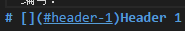
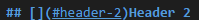
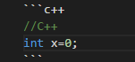
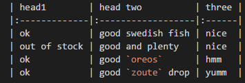
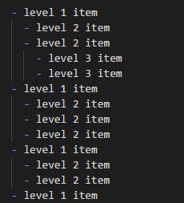
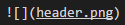
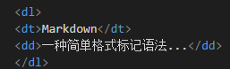
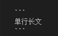

* 粗体、斜体、删除线:** **,_ _, ~~ ~~.
* 段落之间加空格或回车
* 编号：
> 
> 
> 等等以此类推

* 引用：> ;

* 代码：

  > 
* 无序列表：* ;
* 有序列表：1. ;
* 表格，有时候没用
  > 
* 分割线：回车* * *回车
* 嵌套列表：-，用TAB键嵌套
  > 
* 图：
  > 
* 定义列表使用简单的HTML语法实现：
  > 
* 单行长文，不会被自动换行：
  > 
