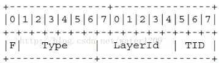

# SHVC解码器阅读记录
* 目的：为我的练手[项目](https://github.com/LongmanLee/lmApp)做准备。
* 对象：SHVC的[参考平台SHM12.1](https://hevc.hhi.fraunhofer.de/svn/svn_SHVCSoftware/tags/SHM-12.1/)解码器
* H.265语法描述符号:
  - ae(v)：基于上下文自适应二元算术编码
  - b(8)：读进连续8bit
  - f(n)：读进连续nbit
  - se(v)：有符号指数Golomb熵编码
  - u(n)：读进连续nbit，解码后的值为无符号整数
  - ue(n)：无符号指数Golamb熵编码
  - 括号中是n表示定长编码，v表示变长编码。

***

## 初步阅读

### NALUnit类

<dl>
<dt>NALUnit</dt>
<dd>封装NALUnit所有的头和负载</dd>
</dl>


* NALUnit头部结构如下

图1 



 ``` c++
struct NALUnit
{
  NalUnitType m_nalUnitType; ///< NALUnit的类型
  UInt        m_temporalId;  ///< 时域分层Id
  UInt        m_nuhLayerId;  ///< 层级Id
  ...//提供返回类型方法;
}
```

1. 每个NALU包含头部（header）和载荷(payload)
  - 头部2byte长度,第0位表 _0禁位_，通常为0， 第1-6位表 _类型_等，其他图1中表示。
  - 载荷整数字节长度。
2. _0x00 00 01_ 为NALU起始码，_0x00 00 00_ 为结束码。载荷中出现的 _0x00 00 00_ 、_0x00 00 01_ 、_0x00 00 02_ 和 _0x00 00 03_ 均在第二个 _0x00_ 后插入 _0x03_，同时，载荷最后字节为 _0x00_ 时，也插入0x03
3. 类型：[NALUnit_type.cpp](../source_code/NALUnit_type.cpp)
  - 32：VPS
  - 33：SPS
  - 34：PPS
  - 39、 40：SEI,补充增强信息
  - ...

### InputNALUnit类和TComInputBitstream 类

<dl>
<dt>InputNALUnit</dt>
<dd>继承NALUnit类，封装了一个TComInputBitstream 类</dd>
</dl>

<dl>
<dt>TComInputBitstream </dt>
<dd>从流文件中读取整个NALUnit的比特</dd>
</dl>
...

### decode函数

* 解码NalUnit函数主要有以下几个：

  - xDecodeVPS(),xDecodeSPS(),xDecodePPS()以及xDecodeSlice()分别解码VPS、SPS，PPS和Slice。
  - VPS：新增的参数集，主要用于传输分级信息，包括多个子层的共享语法元素、操作点关键信息如档次级别、其他操作点信息如虚拟参解码器(HRD)参数。对于SHVC来说，最最有用的是时域子层级和最大层级。
  - SPS：序列参数集，有用信息很多图像信息、编码参数、参考列表等
  - PPS：与SPS存在部分元素重复，会覆盖SPS，解码任意时刻只能激活一个PPS，含有的信息有编码工具可用标志、量化的相关语法主要为QP相关、等等。相比于SPS，感觉用于可视化信息相对少一些。
  - Slice：一帧包含至少1个Slice，相互独立
  - SS：1个Slice可划分为SS，关于SS以后研究。

解码分支跳转示意

```c++
decode()
{
  switch(nalu.m_nalUnitType)
  {
    case NAL_UNIT_VPS：
      xDecodeVPS();return;
    case  NAL_UNIT_SPS:
      xDecodeSPS();return;
    case NAL_UNIT_PPS:
      xDecodePPS();return;
    case NAL_UNIT_CODED_SLICE_TRAIL_R:
    case NAL_UNIT_CODED_SLICE_TRAIL_N:
    case NAL_UNIT_CODED_SLICE_TSA_R:
    case NAL_UNIT_CODED_SLICE_TSA_N:
    case NAL_UNIT_CODED_SLICE_STSA_R:
    case NAL_UNIT_CODED_SLICE_STSA_N:
    case NAL_UNIT_CODED_SLICE_BLA_W_LP:
    case NAL_UNIT_CODED_SLICE_BLA_W_RADL:
    case NAL_UNIT_CODED_SLICE_BLA_N_LP:
    case NAL_UNIT_CODED_SLICE_IDR_W_RADL:
    case NAL_UNIT_CODED_SLICE_IDR_N_LP:
    case NAL_UNIT_CODED_SLICE_CRA:
    case NAL_UNIT_CODED_SLICE_RADL_N:
    case NAL_UNIT_CODED_SLICE_RADL_R:
    case NAL_UNIT_CODED_SLICE_RASL_N:
    case NAL_UNIT_CODED_SLICE_RASL_R:
      ...//上一个NAL是否完毕
      xDecodeSlice()
    ...//其他类型处理
  }
  ...
}
```
### 几个参数集信息的获取和存储
* ...
### 关于shm12.1解码器的源码研究
* 发现一个新的解码参数 **-olsidx x**，指定解码 _x_ 索引层。
* 发现参数 **-ls x**的值存储在一个局部变量，且没有任何使用的地方。
* 由于之前一直无法解码基本层，现在发现的方法为解码两次,如下命令：
```bat
decode.exe -b str.bin -olsidx 0 -o0 el.yuv
decode.exe -b str.bin -olsidx 1 -o1 bl.yuv
```

* 正在研究同时解码所有层，发现VPS中包含层解码信息，关于VPS解码发现 _parseVPSExtension()_函数，涉及到层解码的设置，该函数位于 _parseVPS()_函数中 